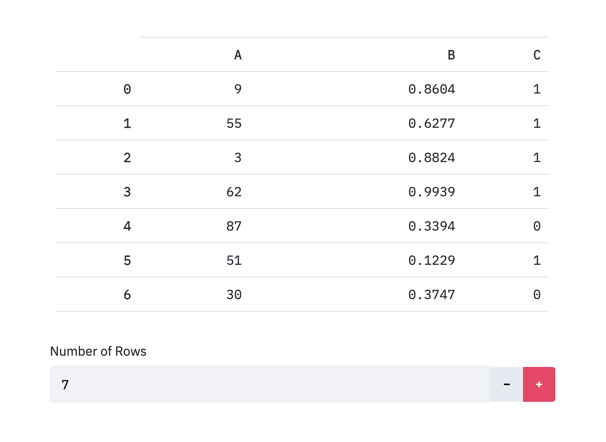
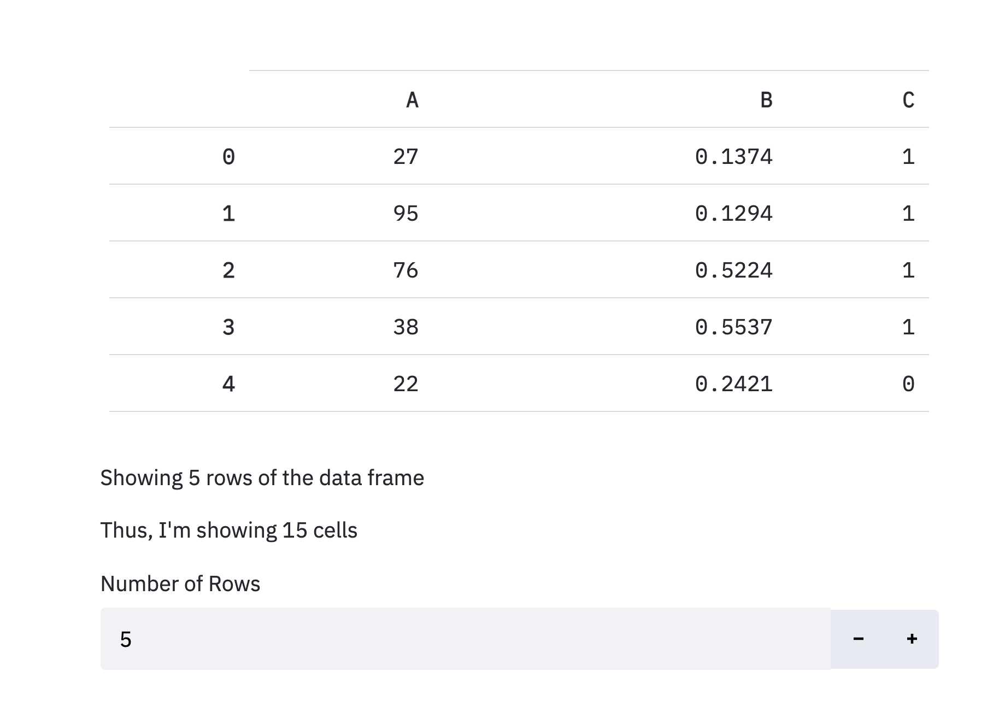

# Weather Prediction App Using Streamlit

**Demonstrating machine learning in Streamlit.**

Streamlit is great for visualizing data. That's its obvious use case. But it can be used for _so_ much more. Here is an example of an application that trains a machine learning model and shows you the results. It saves those results so that you can train another and compare.  

This documentation goes into extreme detail about how this app was built. It is meant as a learning and teaching tool. I encourage you to play around with it first! See below for how to run this app on your machine.

 


## How to run the app on your computer

----

Firstly, you have to have Streamlit installed. This is an obvious one. Simply run the following in your terminal:

```
pip install --upgrade streamlit 
streamlit version
```

Streamlit can sometimes fail to install, so if the second line gives you some sort of error, or fails to print out the current version (needs to be >= 0.70.0), try running the following to install/upgrade several packages the streamlit installer is dependent on:

```
pip install --upgrade protobuf setuptools pip wheel
pip install --upgrade streamlit 
streamlit version
```

Once you have successfully installed Streamlit, download the files in this directory. Then, download the [Australian Weather Data Set](https://www.kaggle.com/jsphyg/weather-dataset-rattle-package) from Kaggle and put it in the `WeatherData` subdirectory.  Now ensure that you have all the dependencies for this application installed. You can just read the `requirements.txt` document, or you can navigate to the `Machine_Learning` directory in your terminal, and type 

```
pip install -r requirements.txt
```

Once all that setup is complete, run the app by running the command

``` 
streamlit run Weather_Prediction_App.py
```

The app should open in your browser and you can play around with it! Note, the first time you open it, it will have to clean the data and might take a minute to load the whole app.


## What the application does

----

Uses the Australian weather data set from [Kaggle](https://www.kaggle.com/jsphyg/weather-dataset-rattle-package), we attempt to predict whether or not it will rain the next day at a given location. There is a script that cleans the data, but this documentation won't go over that.    


The Streamlit app allows you to set hyperparameters and then train a [random forest](https://scikit-learn.org/stable/modules/ensemble.html#forest) model. Caching is used to store the result so that various runs can be compared. This is just a manual grid search - the task could be done much more efficiently by an algorithm - but this is just for the purpose of demonstrating some important and interesting features of the Streamlit package.


## A Quick Blurb About Streamlit

---

If you don't know the basics of how Streamlit works, check out [this tutorial](https://docs.streamlit.io/en/stable/getting_started.html) on the Streamlit website. It goes through the very basics.

The first thing you have to know about Streamlit is that it runs like any other Python script - top to bottom. So any time you do something, the script re-runs. Press a button? The script runs. Change a slider? The script runs. Scroll down the page? Of course the script doesn't run, you didn't take an action.

But understanding this key concept ahead of time will make learning the rest of Streamlit a whole lot easier.


## The Hyperparameters

----

The customizable hyperparameters are achieved via *interactive widgets* in the side bar. These are extremely easy to program and make an app look great right away.  I won't go over what each of the hyperparameters mean (you can, in fact, click to 'Help' button in the app to learn more), but I'll walk you through the basic structure of each of the widgets used in this application.


### Number of trees

The number input widget allows users to put in numbers. The programmer (that's you!) can set restrictions on what kind of numbers can be put in by the user. Let's break down the arguments:

```python
n_trees = st.sidebar.number_input(
    label="Number of Trees in Forest",  # This is the title of your widget
    min_value=1,  # Minimum number allowed to be input
    max_value=None,  # Maximum number allowed (in this case there is no upper bound) 
    value=150)  # The starting value for the number input
```

There are more arguments that are described more in detail <<<<HERE>>>>>, but, as you can see, it's very easy to define the number input for the number of trees in the forest. `n_trees` is now just an integer that we can use like any other variable. There isn't a need to cache it, because Streamlit automatically saves the states of widgets.  


### Maximum tree depth

For this number, we use a slider instead of a number input. While number inputs can accept any number, sliders can only return discrete numbers within a fixed range. A slider, therefore, would be a bad choice for the number of trees widget since we didn't want to add an upper bound.  

Streamlit makes almost everything easy, especially its widgets, so let's look at the slider widget's structure:

```python
max_depth = st.sidebar.slider(
    label="Maximum Tree Depth",  # Widget title
    min_value=1,  # Minimum value
    max_value=30,  # Maximum value
    value=7)  # Starting value
```

Super easy, right? By default it has a step size of 1, but if we wanted to, we could have the slider go in increments of, say, 3. The step size parameter (not used here) is more useful when you're dealing with floating point numbers.


### Minimum samples per split

The select box widget allows a user to select from a list of options. In this case, these options are integers, but they can be most data types (strings, dates, arrays, etc.). The select box is a good choice when there are many predefined options. Let's go over the select box's structure:

```python
min_split = st.sidebar.selectbox(
    label="Minimum Samples Per Split",  # Widget title
    options=list(range(2, 11)),  # Options available to user
    index=0)  # The index of the starting value (in this case the first element in options)
```

You'll start to notice that Streamlit has made the syntax similar throughout their widgets, which is very helpful for us. The `index` parameter shows up in a few widgets, and it's important to understand. It isn't the default value, but the *index* of the default value. So in this case it's the starting element of `[2, 3, 4, 5, 6, 7, 8, 9, 10]`, so 2.


### Feature Split Type

The radio widget is very similar to the select box widget, only it displays all the options as radio buttons. This makes it userful for only small sets of options. More than four or so, and it starts to look very clunky. That's when you opt for the select box. You'll see the argments are identical to those of the select box:

```python
max_features = st.sidebar.radio(
    label="Feature Split Type",  # Widget title
    options=["Square Root", "Log (Base 2)", "All Features"], # Options available to user
    index=0)  # index of starting value
```


### Balance class weight

The checkbox widget is probably of the easiest widget of all. It has very few parameters and very intuitive values. It returns a boolean value, so can be easily used in if statements and the like. Once a checkbox is checked, it remains so until changed by the user.

```python
balanced = st.sidebar.checkbox(
    label="Balance Class Weight",  # Widget title
    value=False)  # It's default value (in this case, unchecked)
```


## The Main Page

----

We'll go over the basic elements of the main page here, and the rest will be covered in the **Caching** section below.  

### Title

Titles are important and everyone loves color! Colors aren't supported in Markdown, so we have to use HTML to get the desired result. Note that Streamlit has stated that HTML can be unstable and thus requires the parameter `unsafe_allow_html=True` and reserves the right to remove this feature at any time.

I'm not trying to do anything crazy fancy with HTML; I just want a little more customization. Here, I change the text alignment to center, increase the font size, change the font to Arial, and make the title blue. I'll separate it out by lines so you can see what's going on if you're unfamiliar with HTML.

```python
html_title = ("<h1 style='text-align: center; "
              "font-size: 3.0 em; "
              "font-family: Arial; "
              "color: DodgerBlue;'> "
              "Australian Rain Predictions </h1>")
st.markdown(html_title, unsafe_allow_html=True)
```

I have gotten pretty much all my HTML knowledge from [here](https://www.w3schools.com/html/html_styles.asp).

Of course, if you don't have a preference about styling, you can use the built in title function:

```python
st.title("Australian Rain Predictions")
```

### Image

Streamlit has an extremely easy way to add photos:

```python
pth = "https://image.freepik.com/free-photo/umbrella-rain_7186-1070.jpg"
umbrella = st.image(pth, use_column_width=True)
```

Here, we pull a free stock image and use the `st.image` feature. Optionally, I set it to use the column width as the photo width, which can be useful when making sure ratios are preserved between different screens.

### Headers

These are crazy easy to use and look great. All you have to write is 

```python
st.header("Rainfall Data")
```

### Data Frame

Here's where things start to get fun. You can simply add a data table using 

```python
st.table(df.head(5))
```

But we want to make it a little more interactive. How about changing the number of rows that can be displayed? Great! Let's do that.  

First thing's first. We've got to talk about **containers**. These are a beta feature in streamlit right now, but they are the best improvement made in a long time (beta feature just means it'll have some bugs, but it won't go away in the future).  

Normally, when you write Streamlit code, the elements appear top to bottom how you add them in your script. But what if you want to change an element with a button below it? That's where you should either use a (beta) container or use the `st.empty()` feature. Let's look at the latter first.

Let's say we want to display a data frame, but the number of rows is controlled by a number input widget. We want the widget to be below the data frame because it looks better. Can you see why this code won't work?

```python
st.table(df.head(n_rows))
n_rows = st.number_input("Number of Rows", 1, 50, value=5)
```

Since a Streamlit app always runs through the script top to bottom each time an action is taken, it hasn't seen the variable `n_rows` by the time it gets to that first line. So it'll throw an error. Here's the simplest way to fix that:

```python
table_holder = st.empty()
n_rows = st.number_input("Number of Rows", 1, 50, value=5)
table_holder.table(df.head(n_rows))
```

Note that in that third line, we use `table_holder.table()` instead of `st.table()`. Now the table is inserted at the saved slot. 




Awesome! So now that works. But what if we want to put a lot of things that depend on `n_rows` above the number input widget? We could define a ton of `st.empty()` variables. This is how it was done until quite recently. But now we can use the concept of containers.

A container acts just like `st.empty()` if `st.empty()` could hold many things. It is a way to hold the spot for an arbitrary number of widgets, tables, text, and so on. Let's see what that would look like:

```python
# Save space for various elements
table_container = st.beta_container()
n_rows = st.number_input("Number of Rows", 1, 50, value=5)

# Add things to our container
table_container.table(df.head(n_rows))
table_container.write(f"Showing {n_rows} rows of the data frame")
table_container.write(f"Thus, I'm showing {n_rows * df.shape[1]} cells")
```




Amazing! We've got to cover one more topic before we go over the code in our Weather App, which is the concept of **columns**. Obviously, you know what a column is. And in Streamlit, it's very intuitive: a column is a container that takes up part of the screen. So if I use 2 columns, then I have 2 parts of the screen that act just like the containers we used above.   

The syntax is very simple:

```python
column1, column2 = st.beta_columns(2)
```


So now, let's dive into the code that makes our Weather App work!

First we'll define our container, Within our container, we hold a spot for the table and create 2 buttons side by side.

```python
data_cont = st.beta_container()
table_spot = data_cont.empty()
b1, b2, _, _ = data_cont.beta_columns(4)
minus_rows = b1.button("Fewer Rows")
plus_rows = b2.button("More Rows")
```


So next we define what goes on when we hit the buttons. Save your questions on the cached variables until later. We'll explain them in the **Caching** section below.

```python
# If we don't have a previous value, default to 5 rows of data
if cached["display_data"] is None:
    cached["display_data"] = pd.concat([data["y_train"].head(5),
        data["X_train"].head(5)], axis=1).reset_index(drop=True)

# If the minus button is hit, decrease the number of rows displayed
elif minus_rows:
    L = max(1, len(cached["display_data"]) - 1)
    cached["display_data"] = pd.concat([data["y_train"].head(L),
        data["X_train"].head(L)], axis=1).reset_index(drop=True)

# And if the plus button is hit, increase the number of rows displayed    
elif plus_rows:
    L = len(cached["display_data"]) + 1
    cached["display_data"] = pd.concat([data["y_train"].head(L),
        data["X_train"].head(L)], axis=1).reset_index(drop=True)

    
# We'll use Pandas styling to display only 2 decimal points
sty_df = cached["display_data"].style.set_precision(2)

# And display the formatted data frame in the spot we saved for it
table_spot.table(sty_df)
```

Hooray! Now you (hopefully) understand what the containers do. They are extremely helpful for when we want to insert elements out of order. And columns help us organize our app in a more intuitive manner.


### Trained model text

In this application, if you have trained a model, it'll display the structure of the model that was most recently trained. One of the most useful functions in Streamlit is the `write` function. We get this output by simply using

```python
st.write(model_dict["current_model"])
```

Where `model_dict["current_model"]`is where the current model is stored. Streamlit handles the fact that this is an sklearn model and just writes the output that would be printed in a normal script!


### Model Performance

We won't go over what these values mean or how they're calculated, just how to display them once they're computed.

Here we make liberal use of Streamlit's built in functions that have great defaults. It makes everything look so pretty without us even trying!

```python
# Add a header, subheader, explanation text, and then a table
st.header("Model Performance:") 
st.subheader("Metrics")
st.write("How good is the model? You want these to be close to 1.")
st.table(cached["performance"]["metrics"])
```

Way too easy, right?

Don't worry, we'll go over the variable `cached` later; just know it's a dictionary holding some informatio we want to use.

So now for the confusion matrices:

```python
# Add the header and some text
st.subheader("Confusion Matrix")
st.write("How did the model get it wrong?")

# Create our columns
col1, col2 = st.beta_columns(2)

# We'll need these for conditional formatting
txt = ["*Predicted too much rain*",  "*Didn't predict enough rain*"]

# Use some more HTML styling to center the text
col1.markdown("<h3 style='text-align: center'>Training Data</h3>",
              unsafe_allow_html=True)

# Display the table and some conditionally formatted text
con1 = cached["performance"]["confusions"][0]
col1.table(con1)
col1.markdown(txt[0] if con1.iloc[0][1] < con1.iloc[1][0] else txt[1])

# Do it all over for the testing data confusion matrix in the next column
col2.markdown("<h3 style='text-align: center'>Testing Data</h3>",
              unsafe_allow_html=True)
con2 = cached["performance"]["confusions"][1]
col2.table(con2)
col2.markdown(txt[0] if con2.iloc[0][1] < con2.iloc[1][0] else txt[1])
```

Hopefully the code makes sense to you now. While there's quite a few lines, each one does something simple and is really quite self-explanatory. I love that Streamlit uses very descriptive function names, such as `header`, `markdown`, and `table`. So easy to remember and a breeze to read.


### The expandable model performance container

So we've gone over containers already, but there's one that we haven't covered, which is the expander container. This container works _exactly_ like the other container, only this time, it can collapse and expand. Very useful for verbose output you might not want to see all the time.

The syntax is just as simple as the container syntax:

```python
# Expanding containers require a title and optionally their default open state
past = st.beta_expander("Trained Model Performances", False)
past.header("You've Trained These Models:")
```

Perfect! We also added a styled data frame, but we won't go into detail about styling data frames here.


## Caching

----

Finally! You can learn what all this *caching* nonsense I've been dancing around is. 

Well, it's not nonsense. It's probably **the most important** concept to using Streamlit effectively.

So why did I wait so long to explain it? Because it's complex and is made easier by understanding the rest of Streamlit.

Remember that blurb about Streamlit above? That's key. Every time you take an action, the script re-runs. So if you perform an intensive calculation, like training a machine learning model, and then click a button, that model is no longer in memory. That is, unless you cache it.

Caching is important not only for speed, but also for persistance of variables. Consider our app. We can train as many random forests as we want and it'll compare the results in a table for us. And if we put in the same parameters, it doesn't re-train the model, it just loads it into memory. This is all achieved by the singe best line of Streamlit code:

```python
@st.cache(allow_output_mutation=True)
```

You place this decorator above any function you want to cache.

The most obvious example is loading in data. You don't want to load in data each time you press a button, so you create a data loading function that will only run once:

```python
@st.cache(persist=True, suppress_st_warning=True, show_spinner=False)
def load_data():
    data_path = os.path.join("WeatherData", "cleaned_weather.csv")
    data = pd.read_csv(data_path)
    return data
```

Now the data will only load in once and we can do whatever we wish to it. (Our actual data loading function is more complex as it makes sure the data is cleaned and then splits it into training and testing data).

But caching is extremely important for more than just data frames. Any time we compute a variable - whether it's an expensive computation or not - and want to use it later, we have to store it in cache. That's why our code uses the `cached` dictionary so much. Since dictionaries are mutable, we just stored all of our values in there. 

Let's take a look.

```python
@st.cache(persist=True, allow_output_mutation=True)
def cached_values():
    """ Save variables between runs """
    with open("./help_text.txt") as f:
        help_text = f.readlines()
    metric_idx = ["Train F1", "Test F1", "Train AUC", "Test AUC",
                  "n_estimators", "max_depth", "min_samples_split",
                  "max_features", "class_weight"]
    
    values = {"display_data": None,
              "help_text": "".join(help_text),
              "help_text_state": {"show": False},
              "performance": {"metrics": None, "confusions": None},
              "past_metrics": pd.DataFrame(index=metric_idx),
              }
    return values
```

This function defines some variables we want to keep in memory - like the help text - but also returns a dictionary with some blank values, such as `"display_data": None`. These values can be updated and the updates will stay in memory.

Each time we run the script, we fetch the results out of cache by simply calling this function:

```python
cached = cached_values()
```

And since dictionaries update in place, any time we update a value or add a new key-value pair, the dictionary will stay in that 'mutated' state.

Let's go back to our example where we changed the number of rows that are displayed:

```python
# If we haven't added "display_data" to the cached dictionary (and thus it's empty),
# add it to the dictionary with a default of 5 rows
if cached["display_data"] is None:
    cached["display_data"] = pd.concat([data["y_train"].head(5),
        data["X_train"].head(5)], axis=1).reset_index(drop=True)

# If we hit the minus button, decrease the number of rows displayed by one and also
# save that differently sized data frame into cached["display_data"]
elif minus_rows:
    L = max(1, len(cached["display_data"]) - 1)
    cached["display_data"] = pd.concat([data["y_train"].head(L),
        data["X_train"].head(L)], axis=1).reset_index(drop=True)

# Ditto with the plus button
elif plus_rows:
    L = len(cached["display_data"]) + 1
    cached["display_data"] = pd.concat([data["y_train"].head(L),
        data["X_train"].head(L)], axis=1).reset_index(drop=True)
```

Hopefully this part of the code makes sense now!

Since buttons are a "one-time action", we need a way to store how many rows to display, and that's where this cache comes into effect. Between runs, we store the data frame that we want to display. Then, when we go to display it, we just have to call upon `cached["display_data"]`. 

We also use caching to store the previously trained models. In that case, we simply initialize a dictionary:

```python
@st.cache(persist=True, allow_output_mutation=True)
def get_models():
    return {"current_model": None}
```

It currently has one key, but when a new model is trained, we save the model and its parameters in memory thusly:

```python
model_dict[model_name] = {"model": model, "parameters": parameters}
```

It's that simple!

