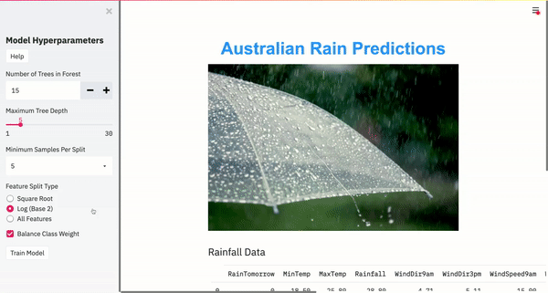
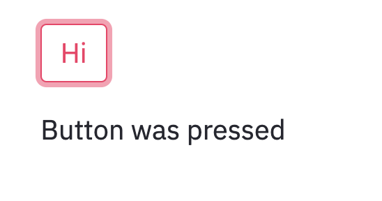

# Streamlit: Easy Dashboarding in Python

**Create beautiful apps using only Python and the power of Streamlit.** 

Streamlit is great open-source Python package that has gained attention lately. And rightly so. It's an extremely useful and intuitive tool that enables anyone who can program in Python to create their own interactive dashboards and machine learning applications. 

The project grew out of the need for data scientists to have a way to write their own accessible tools. For the developers of the package, standard workflows were a jumble of Jupyter Notebooks, Flask, Vue, and React. Python code had to be passed off to a tools team that had many projects to work on, resulting in very slow changes. But, by the nature of data science, requirements change very rapidly. 

In response, Adrien Treuille and a couple of friends decided to create their own solution, and Streamlit was born. Their aim was to help data scientists create their own apps to interactively explore data, parse large data sets, and experiment with running models on different data sets with ease. 

And once these apps are written, they can be shared with ease, allowing for quick and understandable demonstrations that anyone can play with.

## Getting Started

----

First thing's first: install Streamlit on your machine. Simply run the following in your terminal:

```
pip install --upgrade streamlit 
streamlit version
```

Streamlit can sometimes fail to install, so if the second line gives you some sort of error, or fails to print out the current version (needs to be >= 0.70.0), try running the following to install/upgrade several packages the streamlit installer is dependent on:

```
pip install --upgrade protobuf setuptools pip wheel
pip install --upgrade streamlit 
streamlit version
```


## The Awesome Stuff about Streamlit

----

 

Streamlit allows machine learning teams to build maintainable and accessible apps. 

So often in machine learning, tools start out as an individual’s exploration in a private Jupyter Notebook. But as the tool becomes more useful, it needs to be shared with others. Thus, it gets turned into a Flask app, which requires knowledge of HTML, HTTP requests, callbacks, and more. And since most data scientists’ primary programming language is Python, this becomes an onerous task. 

But now there’s Streamlit, a package written entirely in Python that builds beautiful, accessible apps. Streamlit has a gallery of really awesome examples on their [website](https://www.streamlit.io/gallery) for anyone to explore.

Streamlit’s main appeal is its embrace of Python scripting. Streamlit apps are simply Python scripts that run top to bottom, eliminating the need for knowledge about and use of hidden states, callbacks, etc. 

Information can be safely reused across runs by creating a cached function with only one additional line of code. Thus, the code that loads in the data is only run once as long as the app is running.

### What can it do?

Anything!

Well, not really.

Here's a few examples:

-   **Data Exploration:** Streamlit can be used as an interactive visual data exploration tool. The first step of any machine learning project is to understand the story the data is telling. What variables are correlated? How are variables distributed? How do they change over time? 
-   **Proof-of-Concept Dashboards:** Progress on a project, preliminary results, and potential use cases can be shown to others without spending an exorbitant amount of time and resources building an application that may come to nothing. 
-   **Model Training Progress:** Data scientists often want to inspect a model’s performance as it trains. Visuals often provide more useful and rapid feedback than numerical output. 

Using your imagination, you can build many more things by simply piecing together the Streamlit components.

 

### How Can I Get Started?

Well, you can continue to read here. It'll give you some of the basics.

But I found the [4 part introduction](https://www.youtube.com/watch?v=R2nr1uZ8ffc&t=11s) Adrien Treuille released on YouTube most useful to get a feel for the tool. As the author, he explains things extremley clearly and accurately. He also published an article on [Towards Data Science](https://towardsdatascience.com/coding-ml-tools-like-you-code-ml-models-ddba3357eace) that also provides a good explanation and explains the package's development. 

Additionally, the [tutorials](https://docs.streamlit.io/en/stable/tutorial/index.html) on the Streamlit website are a good jumping off point for new users. They introduce many of the concepts necessary to build a successful application. 

So let's keep going to see what Streamlit is all about.

## The Most Basic App

---

Now that you've got streamlit installed, let's build an app. The simplest app in the world.

```python
st.button("Hi")
```

Save your new application as app,py and navigate to your python script in your terminal. Now run

```
streamlit run app.py
```


 Yay!

But it doesn't do anything.

So let's make it do something:

```python
button = st.button("Hi")
if button:
	st.write("Button was pressed")
```



As you can see, it's very easy to define interactive widgets and use their output.

## Basic Streamlit Concepts

----

***This ReadMe is a work in Progress! ***


### Pythonic Structure


### Caching

